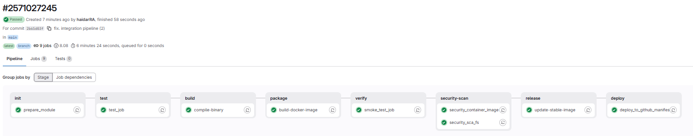
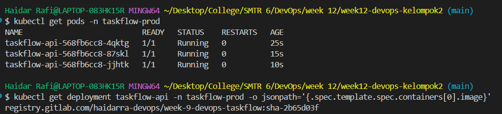
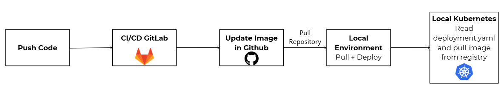

# CI/CD ke Kubernetes

## Screenshot Pipeline CI/CD GitLab


Semua job (mulai dari init sampai deploy) sudah berjalan dengan lancar.

## Hasil Image Baru

Cara menjalankan image terbaru di GitHub:
1. Pull repository dengan command `git pull origin main`.
2. Apply pod baru dengan image yang baru dengan menjalankan `./deploy.sh`.
3. Cek pod yang menggunakan image baru dengan command `kubectl get pods -n taskflow-prod`.
4. Cek image yang digunakan oleh pod menggunakan command berikut.

    ```
    kubectl get deployment taskflow-api -n taskflow-prod -o jsonpath='{.spec.template.spec.containers[0].image}'
    ```

### Hasil:



## Diagram Alur



Alur CI/CD sampai Kubernetes adalah sebagai berikut.
1. Developer push code ke GitLab.
2. GitLab menjalankan proses (job) mulai dari `init` sampai `deploy`.
3. GitLab push image tag baru ke GitHub.
4. Developer pull repository GitHub dengan image tag terbaru dan menjalankan proses deployment dengan menjalankan `deploy.sh`.
5. Kubernetes membaca `deployment.yaml`, kemudian pull image baru dari GitLab registry dan membuat serta menjalankan pod baru dengan image terbaru.

## Pertanyaan Singkat
1. Apa yang terjadi di Kubernetes jika job build di pipeline gagal? Apakah deployment tetap berjalan?
Jawaban:
Jika job `build` gagal, pipeline GitLab akan langsung terhenti (failed) dan job selanjutnya (`deploy`) tidak akan dieksekusi. Di sisi Kubernetes, deployment lama yang sudah ada tetap berjalan normal tanpa gangguan (tidak mati). Kubernetes mempertahankan status aplikasi terakhir yang stabil karena tidak menerima instruksi perubahan manifes dari repositori GitHub.

2. Mengapa kita pakai needs: build di job deploy?
Jawaban:
Keyword `needs` digunakan untuk menerapkan metode DAG (Directed Acyclic Graph) pada pipeline. Job `deploy` membutuhkan hasil dari proses `build`/`release` (berupa Docker image baru yang valid dan aman). Dengan `needs`, job `deploy` hanya akan berjalan jika job yang ditargetkan sukses, sekaligus mempercepat eksekusi pipeline karena job bisa langsung berjalan tanpa menunggu seluruh job lain di stage sebelumnya selesai.

3. Apa bedanya pendekatan ini dengan cara deploy manual yang lama?
Jawaban:
Perbedaan utama antara pendekatan deploy CI/CD otomatis dengan deploy manual adalah deploy CI/CD otomatis mampu menyelesaikan proses deployment dan update image dengan efisien, sedangkan pendekatan deploy manual perlu mengganti image di repository GitHub secara manual yang membutuhkan waktu lebih lama.